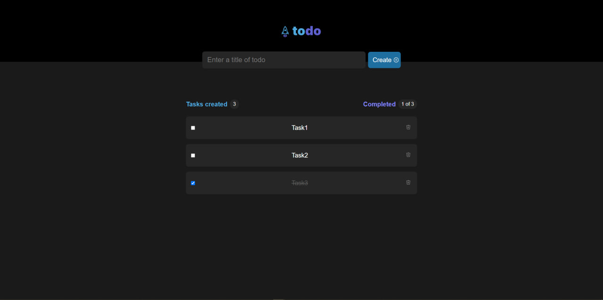

# **React & Django Todo App**

## Description
A simple Todo application using **React on Vite** and **Fastapi** for todo-app. It allows you to add, edit, and delete tasks, as well as mark them as completed.

## **Features**
- Adding new tasks.
- Editing existing tasks.
- Deleting tasks.
- Marking tasks as completed.

## **Tech Stack:**
  - Frontend: React, Vite.js, axios, zustand, react-hot-toast
  - Backend: Fastapi, alembic, aiosqlite
  - DevOps: Docker, docker-compose
---

## **Installation**

Clone my project
```cmd
    git clone https://github.com/Fialex1212/react-fastapi-todo.git
```

### **Frontend**
Run the frontend

```bash
  cd frontend
  cd todo
  npm install
  npm run dev
```

### **Backend**
Run the backend

```cmd
  cd backend/src
  python -m venv venv
  .\venv\scripts\activate
  pip install requirements.txt
  uvicorn main:app
```

### **Run using Docker**
Run the docker-compose

```cmd
  docker-compose up --build
```

Backend by this path - http://127.0.0.1:8000/

Frontend by this path - http://localhost:4173/

## **API Reference**

### Create a Todo

```http
POST /api/todo/create
```

**Description:** Create a new todo task.

#### Request Body

| Parameter     | Type         | Description                |
| :------------ | :----------- | :------------------------- |
| `title`       | `string`     | **Required**. Title of the task |
| `description` | `string`     | Optional. Description of the task |

#### Example Request
```json
{
  "title": "Create new app",
  "description": "Create new app with cool functional"
}
```

#### Example Response
```json
{
  "title": "Create new app",
  "description": "Create new app with cool functional",
  "is_completed": false,
  "id": "a46283a7-368d-4725-a4e2-dcf6698bc4a8",
  "created_at": "2024-09-26T15:40:37.044667",
  "updated_at": "2024-09-26T15:40:37.044667"
}
```

---

### Get a Todo by ID

```http
GET /api/todo/get/{todo_id}
```

**Description:** Retrieve a specific todo task by its ID.

#### Path Parameter

| Parameter  | Type     | Description           |
| :--------- | :------- | :-------------------- |
| `todo_id`  | `string` | **Required**. Task ID |

#### Example Response
```json
{
  "title": "Title",
  "description": "Description",
  "is_completed": false,
  "id": "a46283a7-368d-4725-a4e2-dcf6698bc4a8",
  "created_at": "2024-09-26T15:40:37.044667",
  "updated_at": "2024-09-26T15:40:37.044667"
}
```

---

### Get List of Todos

```http
GET /api/todo/list?skip={skip}&limit={limit}
```

**Description:** Retrieve a list of todo tasks with optional pagination.

#### Query Parameters

| Parameter | Type | Description                           |
| :-------- | :--- | :------------------------------------ |
| `skip`    | `int` | Number of items to skip (default: 0) |
| `limit`   | `int` | Max number of items to return (default: 100) |

#### Example Response
```json
[
  {
    "title": "Title",
    "description": "Description",
    "is_completed": false,
    "id": "a2dc9498-1da2-4106-8dd5-8093028912ae",
    "created_at": "2024-09-26T15:40:37.044667",
    "updated_at": "2024-09-26T15:40:37.044667"
  },
  {
    "title": "Title",
    "description": "Description",
    "is_completed": false,
    "id": "a46283a7-368d-4725-a4e2-dcf6698bc4a8",
    "created_at": "2024-09-26T15:40:37.044667",
    "updated_at": "2024-09-26T15:40:37.044667"
  }
]
```

---

### Update a Todo

```http
PUT /api/todo/update/{todo_id}
```

**Description:** Update a specific todo task.

#### Path Parameter

| Parameter  | Type     | Description           |
| :--------- | :------- | :-------------------- |
| `todo_id`  | `string` | **Required**. Task ID |

#### Request Body

| Parameter      | Type      | Description                      |
| :------------- | :-------- | :------------------------------- |
| `title`        | `string`  | Optional. New title of the task  |
| `description`  | `string`  | Optional. New description        |
| `is_completed` | `boolean` | Optional. Mark as completed      |

#### Example Request
```json
{
  "title": "Updated title",
  "description": "Updated description",
  "is_completed": true
}
```

#### Example Response
```json
{
  "title": "Updated title",
  "description": "Updated description",
  "is_completed": true,
  "id": "a46283a7-368d-4725-a4e2-dcf6698bc4a8",
  "created_at": "2024-09-26T15:40:37.044667",
  "updated_at": "2024-09-26T15:45:37.044667"
}
```

---

### Delete a Todo

```http
DELETE /api/todo/delete/{todo_id}
```

**Description:** Delete a specific todo task.

#### Path Parameter

| Parameter  | Type     | Description           |
| :--------- | :------- | :-------------------- |
| `todo_id`  | `string` | **Required**. Task ID |

#### Example Response
```json
{
  "title": "Title",
  "description": "Description",
  "is_completed": false,
  "id": "a46283a7-368d-4725-a4e2-dcf6698bc4a8",
  "created_at": "2024-09-26T15:40:37.044667",
  "updated_at": "2024-09-26T15:40:37.044667"
}
```

## Screenshots




## Authors

- [@Aleks Seriakov](https://github.com/Fialex1212)

